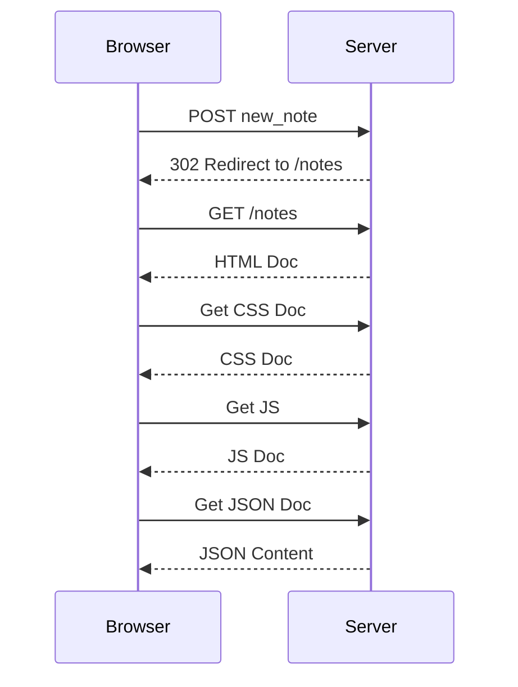

```mermaid
sequenceDiagram
    participant A as Browser
    participant B as Server
    A->>B: POST new_note
    B-->>A: 302 Redirect to /notes
    A->>B: GET /notes
    B-->>A: HTML Doc
    A->>B: Get CSS Doc
    B-->>A: CSS Doc
    A->>B: Get JS
    B-->>A: JS Doc
    A->>B: Get JSON Doc
    B-->>A: JSON Content
```
