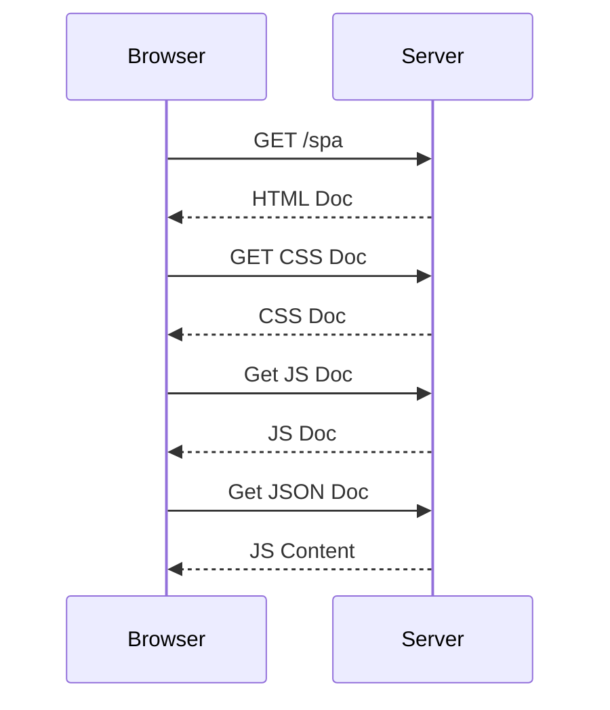

```mermaid
sequenceDiagram
    participant A as Browser
    participant B as Server
    A->>B: GET /spa
    B-->>A: HTML Doc
    A->>B: GET CSS Doc
    B-->>A: CSS Doc
    A->>B: Get JS Doc
    B-->>A: JS Doc
    A->>B: Get JSON Doc
    B-->>A: JS Content
```
